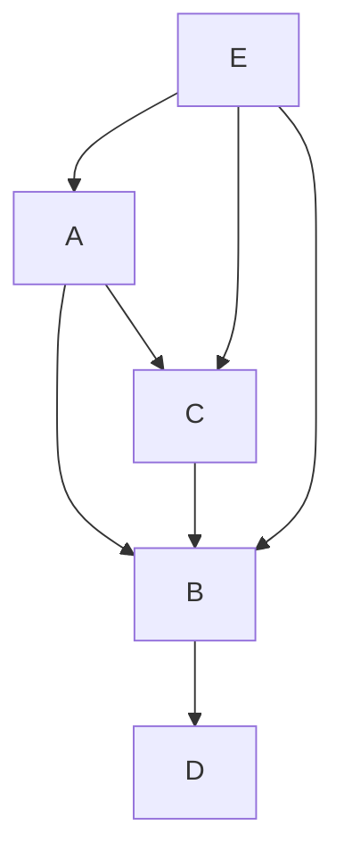
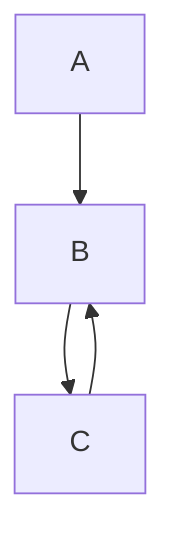

# Dependency resolver API

## traverseWorkspaceRelations

Traverses a dependency graph from a single vertix and returns an ordered map of
vertices. The order can be used, inverted, to compute a set of build steps.

```ts
traverseWorkspaceRelations(
  workspaceName: string,
  workspaces: Record<string, LiteWorkSpaceRecord>,
  breakOnCycle?: boolean,
): OrderedDependencies
```

### Parameters

- `workspaceName`: the name of the starting vertix
- `workspaces`: a record of workspaces expressed in the form
  `{ "workspace_name": { workspaceDependencies?: [ 'another_workspace', ...] }, ... }`
- `breakOnCycle`: Will throw if a cycle (circular dependency) is detected
  (default: falsy). If this is falsy and there is a cycle in the graph, the
  order in the result will not be reliable by definition.

### Example

#### Serial order

```ts
workspaces = {
  a: { workspaceDependencies: ['b', 'c'] },
  b: { workspaceDependencies: ['d'] },
  c: { workspaceDependencies: ['b'] },
  d: { workspaceDependencies: undefined },
  e: { workspaceDependencies: ['a', 'b', 'c'] },
};
```



```ts
traverseWorkspaceRelations('a', workspaces);
/*
// To build a, first build d, then build d, then build c
Map(
    [
        ['c', 1],
        ['b', 2],
        ['d', 3],
    ]
)
*/
```

#### Serial / parallel order

```ts
workspaces = {
  a: { workspaceDependencies: ['b', 'c'] },
  b: { workspaceDependencies: ['d'] },
  c: { workspaceDependencies: ['d'] },
  d: { workspaceDependencies: undefined },
};
```


```ts
traverseWorkspaceRelations('a', workspaces);
/*
// To build a, first build d, then c and b can be built parallely
Map(
    [
        ['c', 1],
        ['b', 1],
        ['d', 2],
    ]
)
*/
```

#### Cycle

```ts
workspaces = {
  a: { workspaceDependencies: ['b'] },
  b: { workspaceDependencies: ['c'] },
  c: { workspaceDependencies: ['b'] },
};
```



```ts
traverseWorkspaceRelations('a', workspaces, false);
/* Will return an unreliable order map */
traverseWorkspaceRelations('a', workspaces, true);
/* Will throw */
```
