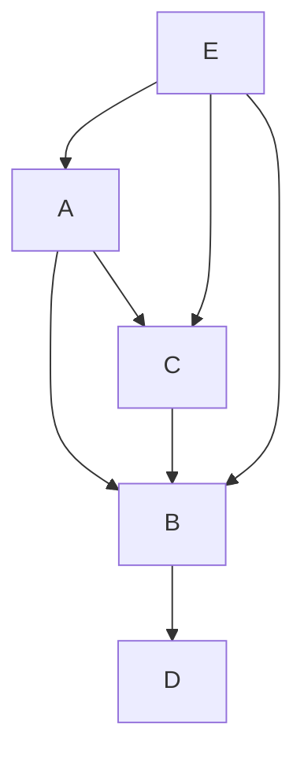

# Dependency resolver API

## traverseWorkspaceRelations

```ts
workspaces = {
  a: { workspaceDependencies: ['b', 'c'] },
  b: { workspaceDependencies: ['d'] },
  c: { workspaceDependencies: ['b'] },
  d: { workspaceDependencies: undefined },
  e: { workspaceDependencies: ['a', 'b', 'c'] },
};
```



```ts
traverseWorkspaceRelations('a', workspaces);
/* Will output
Map(
    [
        ['c', 1],
        ['b', 2],
        ['d', 3],
    ]
)
*/
```
