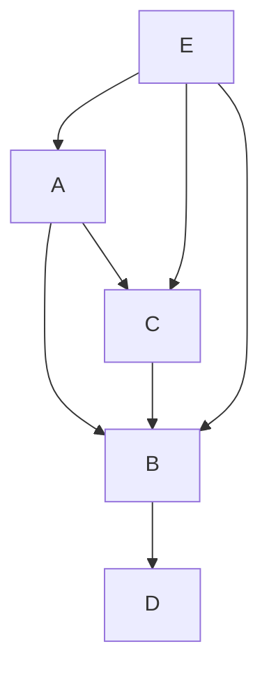
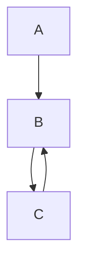
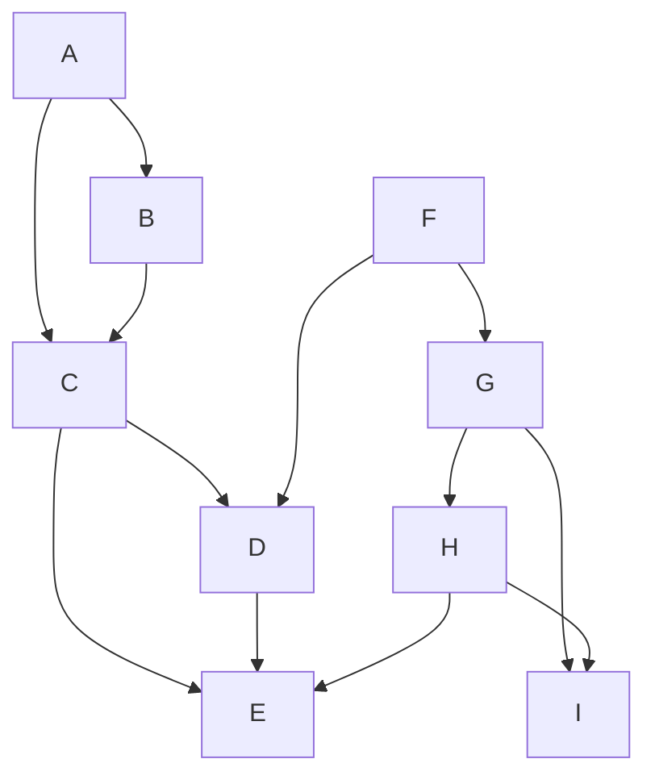
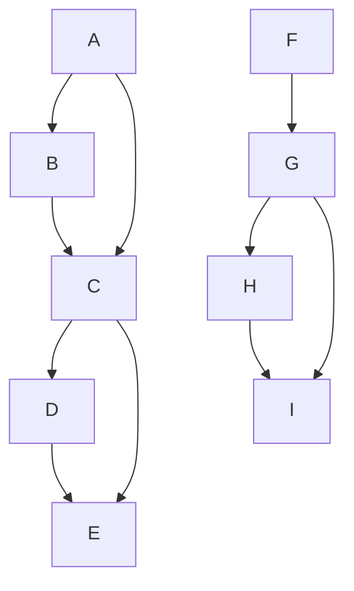
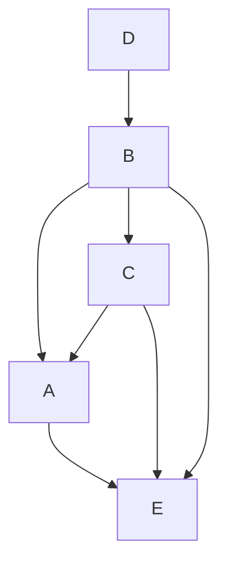

# Dependency resolver API

##

```ts
computeAncestorWorkspaces(
  selectedWorkspaces: WorkspaceContent,
  allWorkspaces: WorkspaceContent,
): WorkspaceContent
```

Given a `WorkspaceContent` A (`selectedWorkspaces`), which is a subset of
another `WorkspaceContent` B (`allWorkspaces`), return a `WorkspaceContent` C,
which contains all the ancestors of A within B, **including** A. This is
essentially a wrapper of `computeAncestorSet` that takes and returns
`WorkspaceContent` values and includes the original dependencies in the result.

## computeAncestorSet

From one or more vertices in a graph, compute the flat set of all their
ancestors (excluding the vertices themselves). This function will work with
cycles, since it doesn't compute the dependency order.

```ts
computeAncestorSet(
  originWorkspaces: string[],
  allWorkspaces: Record<string, WorkspaceDependencyObject>,
): Set<string>
```

### Parameters

- `originWorkspaces`: the name of the vertices of which we want to know the
  ancestors
- `allWorkspaces`: a record of workspaces expressed as
  `{ "workspace_name": { workspaceDependencies?: [ 'another_workspace', ...] }, ... }`

### Example

```ts
const workspaces = {
  a: { workspaceDependencies: ['b', 'c'] },
  b: { workspaceDependencies: ['d'] },
  c: { workspaceDependencies: ['b'] },
  d: { workspaceDependencies: undefined },
  e: { workspaceDependencies: ['a', 'b', 'c'] },
};
```



```ts
computeAncestorSet(['d', 'b'], workspaces))
// Result:  new Set(['a', 'c', 'e'])
```

## computeDescendantSet

From one or more vertices in a graph, compute the flat set of all their
dependants (excluding the vertices themselves). This function will work with
cycles, since it doesn't compute the dependency order.

```ts
computeDescendantSet(
  originWorkspaces: string[],
  allWorkspaces: Record<string, WorkspaceDependencyObject>,
): Set<string>
```

### Parameters

- `originWorkspaces`: the name of the vertices of which we want to know the
  ancestors
- `allWorkspaces`: a record of workspaces expressed as
  `{ "workspace_name": { workspaceDependencies?: [ 'another_workspace', ...] }, ... }`

### Example

```ts
const workspaces = {
  a: { workspaceDependencies: ['b', 'c'] },
  b: { workspaceDependencies: ['d'] },
  c: { workspaceDependencies: ['b'] },
  d: { workspaceDependencies: undefined },
  e: { workspaceDependencies: ['a', 'b', 'c'] },
};
```


```ts
computeDescendantSet(['a', 'b'], workspaces))
// Result:  new Set(['c', 'd'])
```

## traverseWorkspaceRelations

Traverses a dependency graph from an array of vertices and returns a map from
vertices to inverse build order. The order can be used to compute a set of build
steps, where dependencies of the same order can be executed in parallel. This
function will throw in case of cycles, with an exception describing the first
cycle found, because the order can't be computed (e.g. if `a` needs `b` to be
built and `b` needs `a` to be built, their respective order will grow to
`Infinity`).

```ts
traverseWorkspaceRelations(
  workspaceNames: string[],
  workspaces: Record<string, WorkspaceDependencyObject>
): OrderedDependencies
```

### Parameters

- `workspaceNames`: an array of start vertices
- `workspaces`: a record of workspaces expressed as
  `{ "workspace_name": { workspaceDependencies?: [ 'another_workspace', ...] }, ... }`

### Examples

#### Serial order

```ts
workspaces = {
  a: { workspaceDependencies: ['b', 'c'] },
  b: { workspaceDependencies: ['d'] },
  c: { workspaceDependencies: ['b'] },
  d: { workspaceDependencies: undefined },
  e: { workspaceDependencies: ['a', 'b', 'c'] },
};
```


```ts
traverseWorkspaceRelations(['a'], workspaces);
/*
// To build a, first build d, then build d, then build c
Map(
    [
        ['a', 0],
        ['c', 1],
        ['b', 2],
        ['d', 3],
    ]
)
*/
```

#### Serial / parallel order

```ts
workspaces = {
  a: { workspaceDependencies: ['b', 'c'] },
  b: { workspaceDependencies: ['d'] },
  c: { workspaceDependencies: ['d'] },
  d: { workspaceDependencies: undefined },
};
```


```ts
traverseWorkspaceRelations(['a'], workspaces);
/*
// To build a, first build d, then c and b can be built parallely
Map(
    [
        ['a', 0],
        ['c', 1],
        ['b', 1],
        ['d', 2],
    ]
)
*/
```

#### Cycle

```ts
workspaces = {
  a: { workspaceDependencies: ['b'] },
  b: { workspaceDependencies: ['c'] },
  c: { workspaceDependencies: ['b'] },
};
```



```ts
traverseWorkspaceRelations(['a'], workspaces);
/* Will throw */
```

### Multiple vertices with some descendants in common

```ts
workspaces: = {
  a: { workspaceDependencies: ['b', 'c'] },
  b: { workspaceDependencies: ['c'] },
  c: { workspaceDependencies: ['d', 'e'] },
  d: { workspaceDependencies: ['e'] },
  e: { workspaceDependencies: [] },
  f: { workspaceDependencies: ['d', 'g'] },
  g: { workspaceDependencies: ['h', 'i'] },
  h: { workspaceDependencies: ['e', 'i'] },
  i: { workspaceDependencies: [] },
};
```



```ts
/*
Map([
  ['a', 0],
  ['b', 1],
  ['c', 2],
  ['d', 3],
  ['e', 4],
  ['f', 0],
  ['g', 1],
  ['h', 2],
  ['i', 3],
]),
*/
```

### Multiple vertices with no descendants in common

```ts
workspaces = {
  a: { workspaceDependencies: ['b', 'c'] },
  b: { workspaceDependencies: ['c'] },
  c: { workspaceDependencies: ['d', 'e'] },
  d: { workspaceDependencies: ['e'] },
  e: { workspaceDependencies: [] },
  f: { workspaceDependencies: ['g'] },
  g: { workspaceDependencies: ['h', 'i'] },
  h: { workspaceDependencies: ['i'] },
  i: { workspaceDependencies: [] },
};
```



```ts
traverseWorkspaceRelations(['a', 'f'], workspaces))

/*
Lots of parallelism here, since we can build descendants of a at the same time as descendants of f
Map(
  [
    ['a', 0],
    ['b', 1],
    ['c', 2],
    ['d', 3],
    ['e', 4],
    ['f', 0],
    ['g', 1],
    ['h', 2],
    ['i', 3],
  ]),
);
*/
```

## invertDependencyDirection

Takes a dependency graph and inverts the edge direction. The result is a graph
describing the same information as the original but with the relationship
inverted. Useful to produce an ancestor graph from a descendant graph and vice
versa. Please note that, to optimize for performance, this function can produce
graphs in which some `workspaceDependencies` are `undefined` (instead of empty
arrays).

### Parameters

- `workspaces`: a record of workspaces expressed as
  `{ "workspace_name": { workspaceDependencies?: [ 'another_workspace', ...] }, ... }`

### Example

```ts
const workspaces = {
  a: { workspaceDependencies: ['b', 'c'] },
  b: { workspaceDependencies: ['d'] },
  c: { workspaceDependencies: ['b'] },
  d: { workspaceDependencies: undefined },
  e: { workspaceDependencies: ['a', 'b', 'c'] },
};
```


```ts
invertDependencyDirection(workspaces);
```

#### Resulting (inverted) graph

```ts
{
    a: { workspaceDependencies: ['e'] },
    b: { workspaceDependencies: ['a', 'c', 'e'] },
    c: { workspaceDependencies: ['a', 'e'] },
    d: { workspaceDependencies: ['b'] },
}
```


